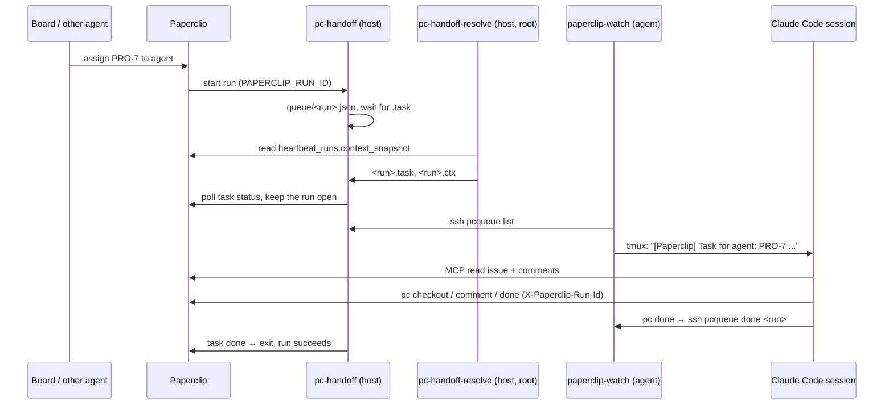

# Architecture

## Pieces

| Piece | Where | Runs as | Job |
|---|---|---|---|
| `pc-handoff` | Paperclip host | Paperclip service user (as the `process` adapter command) | Put the run id into the agent's queue; hold the run open while the task is in progress |
| `pc-handoff-resolve` | Paperclip host | root, cron every minute | Map run → task from the run's context snapshot in the DB; write `<run>.task` and `<run>.ctx` |
| `pc-queue-read` | Paperclip host | `pcqueue`, forced ssh command | `list` the agent's live runs, mark one `done` |
| `paperclip-watch` | agent machine | the agent's user, cron every 2 min | Read the queue, keep `runs.json`, type one notice into the tmux session |
| `pc` | agent machine | inside the Claude Code session | Write to Paperclip with the active run id |
| `paperclip-mcp` | agent machine | Claude Code MCP | Official `@paperclipai/mcp-server` with the agent key, for reading |

## A task, end to end

## Why each piece exists

- **Run holder.** Paperclip requires every agent write to carry an active run id and ends a
  run when the adapter command exits. A command that exits at once (`true`) produces an
  empty successful run; Paperclip then re-wakes the agent and finally parks the task as
  "missing disposition". The holder keeps the run alive while the session works.
- **Resolver.** The `process` adapter passes `PAPERCLIP_RUN_ID` but not the task id. The
  task is in the run's context snapshot in the database. Only root on the host reads it,
  so agents never need database access.
- **Restricted queue account.** Agents live on other machines. They need the run id of
  their own runs and nothing else; a forced command per key gives exactly that.
- **tmux delivery.** A live Claude Code session has no inbound API. The watcher types one
  line into its input — only when the input line is empty. The dim prompt suggestion
  (accepted with Tab) counts as empty; typing replaces it.
- **Write helper.** MCP tools cannot add a request header, so writes go through `pc`.

## Limits

- One notice per task; repeated wakes of the same task (Paperclip retries) are not re-sent.
- At most 6 notices an hour (`PAPERCLIP_WATCH_MAX_PER_HOUR`).
- A run lives up to ~55 minutes. If the task is still open, Paperclip wakes the agent
  again and a new run is delivered.
- Delivery latency: resolver ≤ 1 min + watcher ≤ 2 min.
